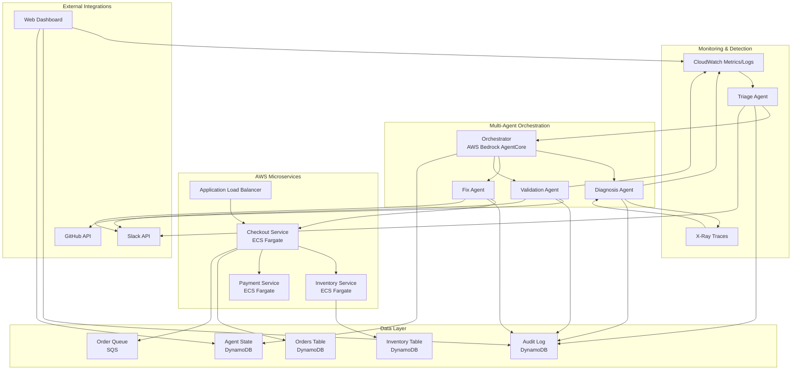
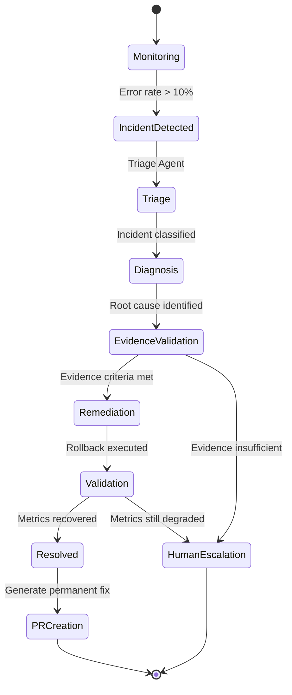

# Design Document: PagerMind

## Overview

PagerMind is an autonomous incident response system built for the Amazon Nova AI Hackathon. The system demonstrates a multi-agent architecture where specialized AI agents collaborate to detect, diagnose, remediate, and validate incident resolution in a production-like AWS microservices environment.

### System Purpose

The system autonomously handles deployment-caused incidents through a structured workflow:
1. **Detection**: Triage Agent monitors CloudWatch metrics and detects anomalies
2. **Diagnosis**: Diagnosis Agent analyzes logs, traces, and deployment history to identify root cause
3. **Remediation**: Fix Agent validates evidence and executes safe rollback operations
4. **Validation**: Validation Agent verifies recovery and creates permanent fix via GitHub PR

### Key Design Principles

- **Evidence-Based Decision Making**: All remediation actions require validated evidence criteria
- **Multi-Agent Collaboration**: Specialized agents with clear responsibilities and structured handoffs
- **Real AWS Integration**: Production-like infrastructure with ECS, DynamoDB, CloudWatch, X-Ray
- **Auditability**: Complete decision trail stored in DynamoDB for analysis and compliance
- **Safety First**: Only AUTO_ALLOWED actions (rollback, restart, scale) without human approval
- **Demonstrable**: Public dashboard for judges to trigger incidents and observe agent workflow

### Technology Stack

- **AI Model**: Amazon Nova 2 Lite via AWS Bedrock AgentCore
- **Orchestration**: AWS Bedrock AgentCore for agent management and workflow coordination
- **Compute**: AWS ECS Fargate for containerized microservices
- **Storage**: Amazon DynamoDB for data, state, and audit trail
- **Messaging**: Amazon SQS for async service communication
- **Observability**: CloudWatch Logs, CloudWatch Metrics, AWS X-Ray
- **Infrastructure**: Terraform/AWS CDK for infrastructure as code
- **Frontend**: Next.js web dashboard with real-time AWS data polling
- **Integration**: GitHub API for PR creation, Slack API for notifications


## Architecture

### High-Level Architecture



### Multi-Agent Workflow State Machine



### Agent Responsibilities

#### Triage Agent
- **Purpose**: Detect incidents and classify severity
- **Inputs**: CloudWatch Metrics (error rate, latency, request count)
- **Outputs**: Incident context (incident_id, severity, affected_service, blast_radius)
- **Decision Logic**: Rule-based thresholds (>10% error rate OR >200% latency increase)
- **Nova 2 Lite Usage**: Generate human-readable incident summary

#### Diagnosis Agent
- **Purpose**: Perform root cause analysis through multi-source correlation
- **Inputs**: Incident context, CloudWatch Logs, CloudWatch Metrics, X-Ray traces, ECS deployment history
- **Outputs**: Root cause hypothesis with supporting evidence
- **Decision Logic**: Temporal correlation analysis (deployment timing vs error spike)
- **Nova 2 Lite Usage**: Analyze logs/traces/metrics to identify patterns and generate hypothesis

#### Fix Agent
- **Purpose**: Validate evidence and execute safe remediation
- **Inputs**: Diagnosis context with root cause hypothesis
- **Outputs**: Remediation execution result (success/failure)
- **Decision Logic**: Evidence criteria validation (4 criteria must all pass)
- **Actions**: ECS service rollback to previous task definition

#### Validation Agent
- **Purpose**: Verify recovery and create permanent solution
- **Inputs**: Remediation context with rollback details
- **Outputs**: Validation result, GitHub PR URL
- **Decision Logic**: Post-remediation metric thresholds (error rate <2%, latency <500ms)
- **Nova 2 Lite Usage**: Analyze code diff and generate permanent fix code

#### Orchestrator
- **Purpose**: Coordinate agent workflow and manage state transitions
- **Implementation**: AWS Bedrock AgentCore
- **Responsibilities**: 
  - Manage workflow state in DynamoDB
  - Pass context between agents
  - Enforce execution timeouts (10 minutes max)
  - Handle agent failures with retry logic
  - Record state transitions in audit log


## Components and Interfaces

### Orchestrator Component

**Implementation**: AWS Bedrock AgentCore

**Responsibilities**:
- Manage workflow state machine transitions
- Invoke agents in sequence with context passing
- Handle agent failures and retries
- Enforce execution timeouts
- Record state transitions

**State Management**:
```python
class WorkflowState:
    incident_id: str
    current_agent: str  # "triage" | "diagnosis" | "fix" | "validation"
    status: str  # "in_progress" | "completed" | "failed" | "escalated"
    context: dict  # Accumulated context from all agents
    started_at: datetime
    updated_at: datetime
```

**API**:
- `start_workflow(incident_id: str) -> WorkflowState`
- `transition_to_agent(incident_id: str, agent_name: str, context: dict) -> WorkflowState`
- `get_workflow_state(incident_id: str) -> WorkflowState`
- `mark_workflow_complete(incident_id: str) -> WorkflowState`
- `escalate_to_human(incident_id: str, reason: str) -> WorkflowState`

### Triage Agent Component

**Interface**:
```python
class TriageAgent:
    def detect_incidents(self) -> List[Incident]:
        """Poll CloudWatch Metrics and detect anomalies"""
        
    def classify_severity(self, error_rate: float) -> str:
        """Classify incident severity based on error rate"""
        
    def calculate_blast_radius(self, service_name: str) -> int:
        """Count dependent services from X-Ray service map"""
        
    def generate_incident_summary(self, incident: Incident) -> str:
        """Use Nova 2 Lite to generate human-readable summary"""
```

**CloudWatch Metrics Query**:
- Namespace: `PagerMind/Services`
- Metrics: `ErrorCount`, `RequestCount`, `Latency`
- Dimensions: `ServiceName`, `Environment`
- Period: 30 seconds
- Statistic: Sum (for counts), Average (for latency)

**Detection Logic**:
```python
def should_create_incident(metrics: MetricData) -> bool:
    error_rate = metrics.error_count / metrics.request_count
    latency_increase = (metrics.current_latency - metrics.baseline_latency) / metrics.baseline_latency
    
    return error_rate > 0.10 or latency_increase > 2.0
```

### Diagnosis Agent Component

**Interface**:
```python
class DiagnosisAgent:
    def analyze_logs(self, service_name: str, time_range: TimeRange) -> List[LogEntry]:
        """Query CloudWatch Logs Insights for error logs"""
        
    def analyze_metrics(self, service_name: str, time_range: TimeRange) -> MetricTimeSeries:
        """Query CloudWatch Metrics for time series data"""
        
    def analyze_traces(self, service_name: str, time_range: TimeRange) -> List[XRayTrace]:
        """Query X-Ray for failed request traces"""
        
    def get_deployment_history(self, service_name: str) -> List[Deployment]:
        """Query ECS for recent deployments"""
        
    def correlate_deployment_with_errors(self, deployments: List[Deployment], error_spike_time: datetime) -> Optional[Deployment]:
        """Find deployment that occurred before error spike"""
        
    def generate_root_cause_hypothesis(self, evidence: Evidence) -> RootCauseHypothesis:
        """Use Nova 2 Lite to analyze all evidence and generate hypothesis"""
```

**CloudWatch Logs Insights Query**:
```sql
fields @timestamp, level, message, status_code, latency_ms, service_name
| filter level = "ERROR" and service_name = "checkout-service"
| sort @timestamp desc
| limit 100
```

**X-Ray Query**:
- Filter: `service(id(name: "checkout-service", type: "AWS::ECS::Container")) AND error`
- Time range: Last 30 minutes
- Extract: Service segments, subsegments (DynamoDB, HTTP calls), error details

**Temporal Correlation Logic**:
```python
def is_deployment_likely_cause(deployment: Deployment, error_spike_time: datetime) -> bool:
    time_diff = (error_spike_time - deployment.completed_at).total_seconds()
    return 0 < time_diff < 1800  # Within 30 minutes after deployment
```

### Fix Agent Component

**Interface**:
```python
class FixAgent:
    def validate_evidence(self, hypothesis: RootCauseHypothesis) -> EvidenceValidationResult:
        """Validate all 4 evidence criteria for rollback approval"""
        
    def execute_rollback(self, service_name: str, target_task_definition: str) -> RollbackResult:
        """Update ECS service to previous task definition"""
        
    def wait_for_deployment(self, service_name: str, timeout: int = 300) -> DeploymentStatus:
        """Poll ECS until deployment reaches COMPLETED status"""
        
    def verify_tasks_running(self, service_name: str) -> bool:
        """Verify new tasks are in RUNNING state"""
```

**Evidence Validation Criteria**:
```python
class EvidenceCriteria:
    def criterion_1_deployment_timing(self, deployment: Deployment, error_spike: datetime) -> bool:
        """Deployment occurred within 30 minutes of error spike"""
        time_diff = (error_spike - deployment.completed_at).total_seconds()
        return 0 < time_diff < 1800
    
    def criterion_2_error_timing(self, error_spike: datetime, deployment: Deployment) -> bool:
        """Error rate increased within 5 minutes after deployment"""
        time_diff = (error_spike - deployment.completed_at).total_seconds()
        return 0 < time_diff < 300
    
    def criterion_3_error_magnitude(self, current_error_rate: float, baseline_error_rate: float) -> bool:
        """Error rate increased by at least 10 percentage points"""
        return (current_error_rate - baseline_error_rate) >= 0.10
    
    def criterion_4_previous_stability(self, previous_task_def: str, lookback_hours: int = 24) -> bool:
        """Previous task definition had error rate below 2% for 24 hours"""
        metrics = get_metrics_for_task_definition(previous_task_def, lookback_hours)
        return all(m.error_rate < 0.02 for m in metrics)
```

**ECS Rollback Execution**:
```python
def execute_rollback(service_name: str, previous_task_def_arn: str) -> RollbackResult:
    ecs_client = boto3.client('ecs')
    
    # Update service to previous task definition
    response = ecs_client.update_service(
        cluster='pagermind-cluster',
        service=service_name,
        taskDefinition=previous_task_def_arn,
        forceNewDeployment=False
    )
    
    # Wait for deployment to complete
    waiter = ecs_client.get_waiter('services_stable')
    waiter.wait(
        cluster='pagermind-cluster',
        services=[service_name],
        WaiterConfig={'Delay': 15, 'MaxAttempts': 20}  # 5 minutes max
    )
    
    return RollbackResult(success=True, new_task_def=previous_task_def_arn)
```

### Validation Agent Component

**Interface**:
```python
class ValidationAgent:
    def wait_for_stabilization(self, duration: int = 60):
        """Wait for metrics to stabilize after remediation"""
        
    def check_recovery_metrics(self, service_name: str) -> RecoveryMetrics:
        """Query CloudWatch for post-remediation metrics"""
        
    def is_incident_resolved(self, metrics: RecoveryMetrics) -> bool:
        """Determine if metrics indicate successful recovery"""
        
    def get_code_diff(self, old_revision: str, new_revision: str) -> CodeDiff:
        """Retrieve code changes between task definition revisions from GitHub"""
        
    def generate_permanent_fix(self, root_cause: RootCauseHypothesis, code_diff: CodeDiff) -> FixCode:
        """Use Nova 2 Lite to analyze changes and generate fix code"""
        
    def create_pull_request(self, fix: FixCode, incident: Incident) -> PullRequest:
        """Create GitHub PR with incident summary and fix"""
```

**Recovery Validation Logic**:
```python
def is_incident_resolved(metrics: RecoveryMetrics) -> bool:
    return metrics.error_rate < 0.02 and metrics.p99_latency < 500
```

**GitHub PR Creation**:
```python
def create_pull_request(fix: FixCode, incident: Incident) -> PullRequest:
    github_client = Github(token=os.environ['GITHUB_TOKEN'])
    repo = github_client.get_repo('org/pagermind')
    
    # Create branch
    branch_name = f"fix/incident-{incident.id}"
    base_branch = repo.get_branch('main')
    repo.create_git_ref(f"refs/heads/{branch_name}", base_branch.commit.sha)
    
    # Create/update files
    for file_path, content in fix.files.items():
        repo.create_file(
            path=file_path,
            message=f"Fix for incident {incident.id}",
            content=content,
            branch=branch_name
        )
    
    # Create PR
    pr = repo.create_pull(
        title=f"[PagerMind] Fix for incident {incident.id}: {incident.summary}",
        body=generate_pr_body(incident, fix),
        head=branch_name,
        base='main'
    )
    
    return PullRequest(url=pr.html_url, number=pr.number)
```

### AWS Microservices Components

#### Checkout Service

**Endpoints**:
- `POST /api/checkout` - Process order checkout

**Dependencies**:
- Inventory Service (HTTP)
- Payment Service (HTTP)
- Orders Table (DynamoDB)
- Order Queue (SQS)

**Request Flow**:
```python
@app.post("/api/checkout")
async def checkout(order: OrderRequest):
    # 1. Check inventory
    inventory_response = await http_client.get(
        f"{INVENTORY_SERVICE_URL}/api/inventory/{order.product_id}"
    )
    if inventory_response.stock < order.quantity:
        raise HTTPException(status_code=400, detail="Insufficient stock")
    
    # 2. Process payment
    payment_response = await http_client.post(
        f"{PAYMENT_SERVICE_URL}/api/payment",
        json={"amount": order.total, "customer_id": order.customer_id}
    )
    if not payment_response.success:
        raise HTTPException(status_code=402, detail="Payment failed")
    
    # 3. Write to DynamoDB
    order_id = str(uuid.uuid4())
    dynamodb.put_item(
        TableName='Orders',
        Item={
            'order_id': order_id,
            'customer_id': order.customer_id,
            'product_id': order.product_id,
            'quantity': order.quantity,
            'total': order.total,
            'status': 'completed',
            'created_at': datetime.utcnow().isoformat()
        }
    )
    
    # 4. Publish to SQS
    sqs.send_message(
        QueueUrl=ORDER_QUEUE_URL,
        MessageBody=json.dumps({'order_id': order_id, 'event': 'order_completed'})
    )
    
    return {"order_id": order_id, "status": "completed"}
```

**Bug Scenario (v2)**:
```python
# BROKEN: Missing GSI, causes full table scan
def get_orders_by_customer(customer_id: str):
    # This query requires a GSI on customer_id, but v2 doesn't have it
    response = dynamodb.query(
        TableName='Orders',
        KeyConditionExpression='customer_id = :cid',  # ERROR: customer_id is not a key
        ExpressionAttributeValues={':cid': customer_id}
    )
    # Falls back to scan, causing 5000ms latency and 20% error rate
```

**Instrumentation**:
```python
# CloudWatch Metrics
cloudwatch.put_metric_data(
    Namespace='PagerMind/Services',
    MetricData=[
        {'MetricName': 'RequestCount', 'Value': 1, 'Unit': 'Count', 'Dimensions': [{'Name': 'ServiceName', 'Value': 'checkout-service'}]},
        {'MetricName': 'ErrorCount', 'Value': 1 if error else 0, 'Unit': 'Count', 'Dimensions': [{'Name': 'ServiceName', 'Value': 'checkout-service'}]},
        {'MetricName': 'Latency', 'Value': latency_ms, 'Unit': 'Milliseconds', 'Dimensions': [{'Name': 'ServiceName', 'Value': 'checkout-service'}]}
    ]
)

# CloudWatch Logs (structured JSON)
logger.info(json.dumps({
    'timestamp': datetime.utcnow().isoformat(),
    'level': 'INFO',
    'service_name': 'checkout-service',
    'message': 'Checkout completed',
    'order_id': order_id,
    'status_code': 200,
    'latency_ms': latency_ms
}))

# X-Ray Tracing
from aws_xray_sdk.core import xray_recorder

@xray_recorder.capture('checkout')
async def checkout(order: OrderRequest):
    # Automatic subsegment creation for HTTP calls and DynamoDB operations
    ...
```

#### Inventory Service

**Endpoints**:
- `GET /api/inventory/{product_id}` - Get product stock
- `POST /api/inventory/reserve` - Reserve inventory

**Dependencies**:
- Inventory Table (DynamoDB)

#### Payment Service

**Endpoints**:
- `POST /api/payment` - Process payment

**Dependencies**:
- External payment gateway (mocked for demo)


## Data Models

### DynamoDB Tables

#### Orders Table
```python
{
    "TableName": "Orders",
    "KeySchema": [
        {"AttributeName": "order_id", "KeyType": "HASH"}
    ],
    "AttributeDefinitions": [
        {"AttributeName": "order_id", "AttributeType": "S"},
        {"AttributeName": "customer_id", "AttributeType": "S"},
        {"AttributeName": "created_at", "AttributeType": "S"}
    ],
    "GlobalSecondaryIndexes": [
        {
            "IndexName": "CustomerIndex",
            "KeySchema": [
                {"AttributeName": "customer_id", "KeyType": "HASH"},
                {"AttributeName": "created_at", "KeyType": "RANGE"}
            ],
            "Projection": {"ProjectionType": "ALL"}
        }
    ],
    "BillingMode": "PAY_PER_REQUEST"
}
```

**Item Schema**:
```python
class Order:
    order_id: str  # UUID
    customer_id: str
    product_id: str
    quantity: int
    total: Decimal
    status: str  # "pending" | "completed" | "failed"
    created_at: str  # ISO 8601 timestamp
    updated_at: str
```

#### Inventory Table
```python
{
    "TableName": "Inventory",
    "KeySchema": [
        {"AttributeName": "product_id", "KeyType": "HASH"}
    ],
    "AttributeDefinitions": [
        {"AttributeName": "product_id", "AttributeType": "S"}
    ],
    "BillingMode": "PAY_PER_REQUEST"
}
```

**Item Schema**:
```python
class InventoryItem:
    product_id: str
    name: str
    stock: int
    reserved: int
    price: Decimal
    updated_at: str
```

#### Audit_Log Table
```python
{
    "TableName": "AuditLog",
    "KeySchema": [
        {"AttributeName": "incident_id", "KeyType": "HASH"},
        {"AttributeName": "timestamp", "KeyType": "RANGE"}
    ],
    "AttributeDefinitions": [
        {"AttributeName": "incident_id", "AttributeType": "S"},
        {"AttributeName": "timestamp", "AttributeType": "S"}
    ],
    "BillingMode": "PAY_PER_REQUEST"
}
```

**Item Schema**:
```python
class AuditLogEntry:
    incident_id: str  # UUID
    timestamp: str  # ISO 8601 with microseconds
    agent_name: str  # "triage" | "diagnosis" | "fix" | "validation"
    action: str  # "detect_incident" | "analyze_root_cause" | "execute_rollback" | "validate_recovery" | "create_pr"
    input_context: dict  # Input data for this agent
    output_context: dict  # Output data from this agent
    nova_reasoning: Optional[str]  # Nova 2 Lite's reasoning text
    nova_token_usage: Optional[dict]  # {"input_tokens": int, "output_tokens": int, "cost_usd": float}
    evidence_validation: Optional[dict]  # For Fix Agent: {"criterion_1": bool, "criterion_2": bool, ...}
    ecs_deployment_details: Optional[dict]  # {"old_task_def": str, "new_task_def": str, "deployment_id": str}
    metrics_snapshot: Optional[dict]  # {"error_rate": float, "latency_p99": float, "timestamp": str}
    pr_details: Optional[dict]  # {"pr_url": str, "pr_number": int, "branch": str}
    error: Optional[str]  # Error message if action failed
```

#### Agent_State Table
```python
{
    "TableName": "AgentState",
    "KeySchema": [
        {"AttributeName": "incident_id", "KeyType": "HASH"}
    ],
    "AttributeDefinitions": [
        {"AttributeName": "incident_id", "AttributeType": "S"}
    ],
    "BillingMode": "PAY_PER_REQUEST"
}
```

**Item Schema**:
```python
class AgentState:
    incident_id: str  # UUID
    current_agent: str  # "triage" | "diagnosis" | "fix" | "validation" | "completed" | "escalated"
    status: str  # "in_progress" | "completed" | "failed" | "escalated"
    context: dict  # Accumulated context from all agents
    started_at: str  # ISO 8601 timestamp
    updated_at: str
    completed_at: Optional[str]
    escalation_reason: Optional[str]
    
    # Incident details
    severity: str  # "CRITICAL" | "HIGH" | "MEDIUM"
    affected_service: str
    error_rate: float
    blast_radius: int
    
    # Diagnosis details
    root_cause_hypothesis: Optional[str]
    suspected_deployment: Optional[str]
    
    # Remediation details
    rollback_executed: bool
    rollback_target_task_def: Optional[str]
    
    # Validation details
    incident_resolved: bool
    pr_url: Optional[str]
```

### SQS Message Schemas

#### Order Queue Messages
```python
class OrderEvent:
    order_id: str
    event: str  # "order_completed" | "order_failed"
    timestamp: str
    customer_id: str
    total: Decimal
```

### API Request/Response Models

#### Checkout Request
```python
class CheckoutRequest:
    customer_id: str
    product_id: str
    quantity: int
    payment_method: str
```

#### Checkout Response
```python
class CheckoutResponse:
    order_id: str
    status: str  # "completed" | "failed"
    total: Decimal
    message: Optional[str]
```

#### Inventory Check Response
```python
class InventoryResponse:
    product_id: str
    name: str
    stock: int
    available: int  # stock - reserved
    price: Decimal
```

#### Payment Request
```python
class PaymentRequest:
    amount: Decimal
    customer_id: str
    payment_method: str
```

#### Payment Response
```python
class PaymentResponse:
    transaction_id: str
    success: bool
    message: Optional[str]
```

### Agent Context Models

#### Incident Context (Triage → Diagnosis)
```python
class IncidentContext:
    incident_id: str
    severity: str
    affected_service: str
    error_rate: float
    baseline_error_rate: float
    current_latency: float
    baseline_latency: float
    blast_radius: int
    detection_timestamp: str
    incident_summary: str  # Generated by Nova 2 Lite
```

#### Diagnosis Context (Diagnosis → Fix)
```python
class DiagnosisContext:
    incident_id: str
    root_cause_hypothesis: str
    evidence: dict
    suspected_deployment: dict  # {"task_def_arn": str, "revision": int, "deployed_at": str}
    error_spike_timestamp: str
    log_samples: List[dict]
    trace_samples: List[dict]
    nova_reasoning: str
```

#### Remediation Context (Fix → Validation)
```python
class RemediationContext:
    incident_id: str
    action_taken: str  # "rollback"
    rollback_details: dict  # {"from_task_def": str, "to_task_def": str, "deployment_id": str}
    evidence_validation: dict  # {"criterion_1": bool, "criterion_2": bool, ...}
    execution_timestamp: str
    pre_rollback_metrics: dict
```

#### Validation Context (Validation → Complete)
```python
class ValidationContext:
    incident_id: str
    incident_resolved: bool
    post_rollback_metrics: dict
    recovery_timestamp: Optional[str]
    pr_url: Optional[str]
    permanent_fix_summary: Optional[str]
```

### CloudWatch Metrics Schema

**Namespace**: `PagerMind/Services`

**Metrics**:
- `RequestCount` (Count): Total requests
- `ErrorCount` (Count): 5xx responses
- `Latency` (Milliseconds): Request duration

**Dimensions**:
- `ServiceName`: "checkout-service" | "inventory-service" | "payment-service"
- `Environment`: "production"

### CloudWatch Logs Schema

**Log Group**: `/ecs/{service-name}`

**Log Format** (JSON):
```python
{
    "timestamp": "2026-03-17T10:30:45.123Z",
    "level": "INFO" | "ERROR" | "WARN",
    "service_name": "checkout-service",
    "message": "Human-readable message",
    "order_id": "optional-uuid",
    "customer_id": "optional-string",
    "status_code": 200,
    "latency_ms": 150,
    "error": "optional-error-message",
    "stack_trace": "optional-stack-trace"
}
```

### X-Ray Trace Schema

**Service Segments**:
```python
{
    "id": "segment-id",
    "name": "checkout-service",
    "start_time": 1710672645.123,
    "end_time": 1710672645.456,
    "http": {
        "request": {"method": "POST", "url": "/api/checkout"},
        "response": {"status": 500}
    },
    "error": true,
    "fault": true,
    "subsegments": [
        {
            "id": "subsegment-id",
            "name": "DynamoDB",
            "start_time": 1710672645.200,
            "end_time": 1710672645.400,
            "aws": {
                "operation": "Query",
                "table_name": "Orders",
                "request_id": "request-id"
            },
            "error": true
        }
    ]
}
```

