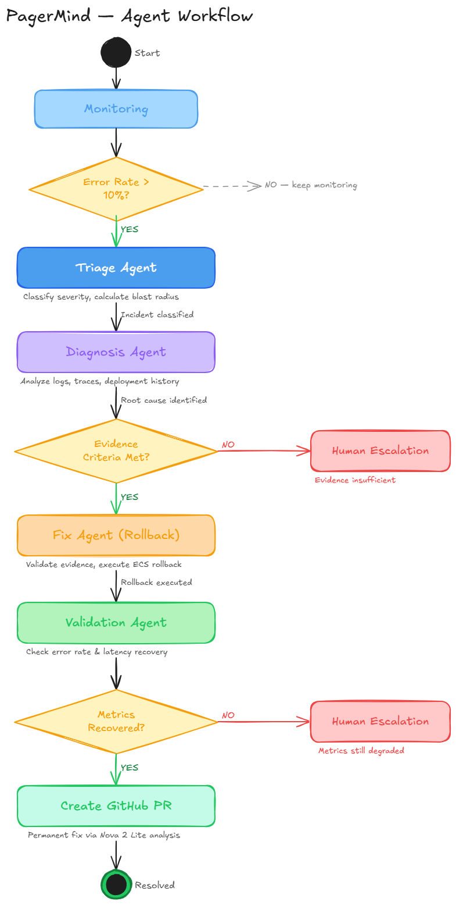
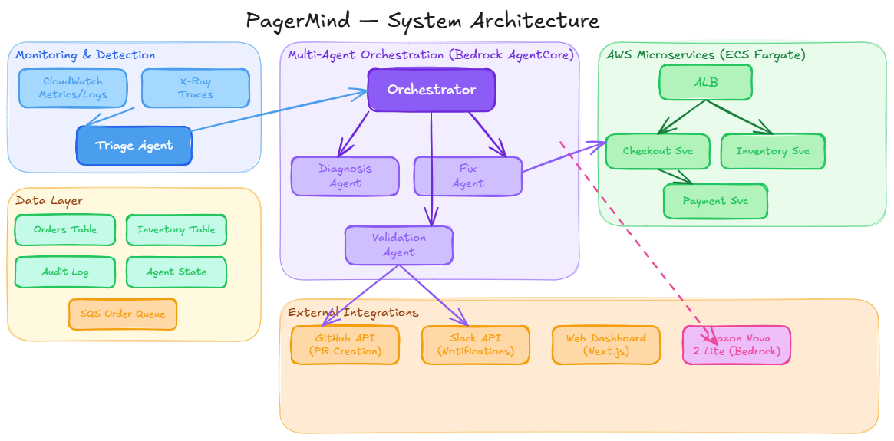

# PagerMind - Autonomous Incident Response System

> **Amazon Nova AI Hackathon 2026**  
> Multi-agent system using Amazon Nova 2 Lite to autonomously detect, diagnose, and fix production incidents

[](https://aws.amazon.com/bedrock/)
[](https://aws.amazon.com/nova/)
[](LICENSE)

## 🎯 Overview

PagerMind is an autonomous incident response system that uses a multi-agent architecture powered by Amazon Nova 2 Lite to automatically detect, diagnose, remediate, and validate production incidents.

### Key Features

- **Multi-Agent Collaboration**: Specialized agents (Triage, Diagnosis, Fix, Validation) work together through AWS Bedrock AgentCore
- **Evidence-Based Decisions**: All remediation actions require validated evidence criteria (no arbitrary confidence scores)
- **Real AWS Infrastructure**: Production-like environment with ECS Fargate, DynamoDB, CloudWatch, X-Ray
- **Autonomous Remediation**: Automatically rolls back bad deployments and creates GitHub PRs with permanent fixes
- **Full Auditability**: Complete decision trail stored in DynamoDB for compliance and analysis

## 🏗️ Architecture

### Agent Workflow

<p align="center">
  
</p>

The system follows a structured workflow:
1. **Monitoring** → Continuous CloudWatch metrics polling
2. **Triage Agent** → Detects incidents and classifies severity
3. **Diagnosis Agent** → Analyzes logs, traces, and deployment history
4. **Evidence Validation** → Validates 4 concrete criteria before action
5. **Fix Agent** → Executes ECS rollback to previous stable version
6. **Validation Agent** → Verifies recovery and creates GitHub PR with permanent fix

### System Architecture



The system integrates multiple AWS services:
- **Monitoring & Detection**: CloudWatch Metrics/Logs, X-Ray Traces
- **Multi-Agent Orchestration**: AWS Bedrock AgentCore with Nova 2 Lite
- **AWS Microservices**: 3 ECS Fargate services (checkout, inventory, payment)
- **Data Layer**: DynamoDB tables (Orders, Inventory, Audit Log, Agent State), SQS queues
- **External Integrations**: GitHub (PR creation), Slack (notifications), Web Dashboard

## 🎯 Demo Scenario

**Incident**: E-commerce checkout service fails after deployment with missing DynamoDB index

**PagerMind Response** (8 minutes end-to-end):
1. **T+0:00** - Deploy v2 with bug (missing GSI)
2. **T+1:30** - Error rate spikes to 20%, latency increases to 5000ms
3. **T+2:00** - Triage Agent detects incident, classifies as CRITICAL
4. **T+3:00** - Diagnosis Agent identifies deployment correlation and missing index
5. **T+4:00** - Fix Agent validates evidence and executes rollback
6. **T+6:00** - Validation Agent confirms recovery (error rate <1%, latency <300ms)
7. **T+8:00** - GitHub PR created with DynamoDB GSI fix

**Result**: Zero human intervention, full audit trail, permanent fix ready for review

## 📁 Project Structure
└── docs/           # Documentation and architecture
```

## 🚀 Quick Start

### Prerequisites
- Python 3.10+
- Node.js 18+
- AWS Account with Bedrock access
- AgentCore CLI installed

### 1. Agent Setup
```bash
cd agent
source .venv/bin/activate  # Windows: .venv\Scripts\activate
agentcore deploy
```

### 2. Backend Setup
```bash
cd backend
python -m venv .venv
source .venv/bin/activate  # Windows: .venv\Scripts\activate
pip install -r requirements.txt
cd src && python main.py
```

### 3. Frontend Setup
```bash
cd frontend
npm install
npm run dev
```

## 📚 Documentation

- [Architecture Overview](docs/ARCHITECTURE.md)
- [Agent Documentation](agent/README.md)
- [Backend API](backend/README.md)
- [Frontend Guide](frontend/README.md)

## 🛠️ Tech Stack

- **AI Model**: Amazon Nova 2 Lite
- **Agent Framework**: Strands SDK
- **Agent Platform**: AWS Bedrock AgentCore
- **Backend**: FastAPI (Python)
- **Frontend**: Next.js (React + TypeScript)
- **Tools**: Code Interpreter, MCP Gateway

## 📝 Development

Each component can be developed independently. See individual README files in each directory for specific instructions.

## 🎯 Hackathon Submission

Built for the Amazon Nova AI Hackathon 2026.

## 📄 License

MIT
